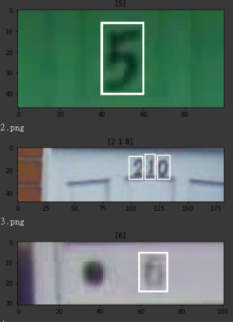
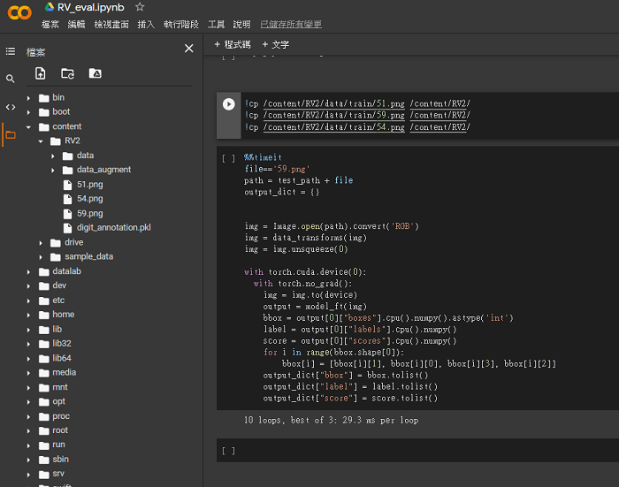

# Visual_Recognition_HW2

## Introduction
The project is training an accurate object detection neteork using Faster R-CNN for [SVHN](http://ufldl.stanford.edu/housenumbers/).

## Usage
We training and testing with Python 3.6, pytorch 1.4 and **Need** to reference [timm](https://github.com/rwightman/pytorch-image-models), [AutoAugment](https://github.com/DeepVoltaire/AutoAugment), [DataAugmentationForObjectDetection](https://github.com/Paperspace/DataAugmentationForObjectDetection) and [mAP](https://github.com/sgrvinod/a-PyTorch-Tutorial-to-Object-Detection).

### Traning and Testing model
First, this Faster R-CNN uses EfficientNet-b4 as a backbone to extract features.\
If you want to use this network for training, you must generate a compliant dataset.

In addition, **my [model](https://drive.google.com/file/d/1QhCpAknxsPdp5527Wq4y8JjgF6a5zFc-/view?usp=sharing) can be loaded for testing**, and this is described in detail in the **Testing model** section.


Before generating the data, Upload  the training images to `/data/train` and the test data to `/data/train`.\
Make sure you have the mat file(default name: **digitStruct.mat**) in the `/data/train` folder.

#### Generate Dataset
Example:

```
python generate_dataset.py
```
***important arguments about Generate Dataset in config.py***

Default:

| Argument    | Default value |
| ------------|:-------------:|
| annotation_file         | SVHN_annotation.pkl       |

 

  
When the program was finished, we will get a file `SVHN_annotation.pkl` in `/model/`.\
Now we have one pkl file .

```
./models/SVHN_annotation.pkl  
```

### Traning Model

Example:

```
python train.py
```

***important arguments about Traning Model in config.py***

Default:
These arguments is basic setting for model.

| Argument    | Default value |
| ------------|:-------------:|
|model_name             |  faster_rcnn_efficientnetb4_v1.pth             |
|batch_size             |  32             |
|workers             |  4             |
|num_classes             |  11  (classes+background)           |
|batch_size             |  32             |
|max_size             |  380  (Resize image )           |
|min_size             |  380  (Resize image )           |

And, these is related to your training performance.

| Argument    | Default value |
| ------------|:-------------:|
|epochs             |  18             |
|learning_rate             |  0.01             |
|momentum           |  0.9           |
|num_classes             |  11  (classes+background)           |
|weight_decay             |  5e-4            |
|milestones             |  [5, 12] (MultiStepLR)           |
|gamma             |  0.1           |

When the program was finished, we will get a traning model file in `/model/`.

```
./model/faster_rcnn_efficientnetb4_v1.pth
```

### Testing Model

If we want to test image, make sure we have a model in `/model/` first and confirm `model_name`.\
In addition, if you want to use my trained model, download this [model](https://drive.google.com/file/d/1QhCpAknxsPdp5527Wq4y8JjgF6a5zFc-/view?usp=sharing) to `/model/` and change the "model_name" to "faster_rcnn_efficientnetb4_v3_8" in `config.py`

Example:

```
python test.py
```

***important arguments about Testing Model in config.py***


Default:

| Argument    | Default value |
| ------------|:-------------:|
|score_threshold             |  0.0             |
|IoU_threshold             |  1.5 (Eliminate overlapping boxes. Normally the range is between 0 ~ 1, 1.5 meaning that the function is not enabled.)             |
|json_name             |      0856566.json       |

When the program was finished, we will get a json file in /result/.
```
./result/0856566.json
```
### Visualize Testing images with bounding box

Adjust a few parameters to visualize the test images with bounding box. (***In pynb, it works***)

***important arguments about Testing Model in config.py***


Default:

| Argument    | Default value |
| ------------|:-------------:|
|IoU_threshold             |  1.5 (suggest 0.2~0.5)             |
|plot_img             |      False (True, if you want to plot testing images)       |

IoU_threshold=0.3 plot_img= True:




## Result 

| Metrics    | value |
| ------------|:-------------:|
|mAP             |               |
|model performance             |             |
